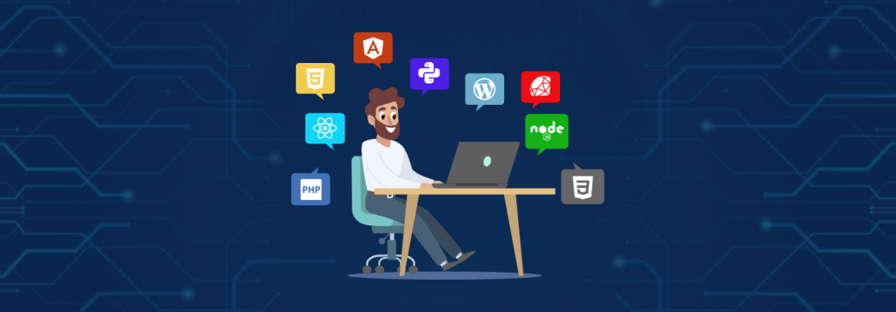

# 👋 ¡Hola! Soy Rubén Pérez García

**Técnico de Sistemas | Desarrollador Web** 💻

  

## 💼 Perfil Profesional

Soy Técnico en Administración de Sistemas Informáticos en Red y actualmente estudio el Grado Superior en Desarrollo de Aplicaciones Web. Me apasiona la tecnología, la automatización de infraestructuras, la seguridad informática y el desarrollo de soluciones innovadoras. Actualmente trabajo para **Ayesa** como Soporte Técnico en el CPD de **Junta de Andalucía**.

---

## 🚀 Habilidades Técnicas

### 🔧 Administración de Sistemas

- Linux & Windows Server
- Gestión de redes y seguridad
- Automatización y scripting

  
  
  

---

### 🗄️ Bases de Datos

- Diseño, administración y mantenimiento de bases de datos relacionales y no relacionales.
- Conocimientos en consultas SQL, modelado de datos y optimización de rendimiento.
- Experiencia con MySQL, Oracle, MariaDB y MongoDB.

  
  
  
  

---

### ☁️ Cloud & Virtualización

- AWS, Azure
- Máquinas virtuales y entornos híbridos
- Docker & Kubernetes

  
  
  
  

---

### 🌐 Desarrollo Web

- HTML5, CSS3, JavaScript
- PHP
- Diseño y estructura responsive

  
  
  
  

---

### 🧠 Programación

- Java, Python, C++
- Orientación a objetos y estructuras de datos
- Buenas prácticas y metodologías ágiles

  
  
  

---

## 📬 Contacto

---

  
   
  

---

> 💡 Siempre en búsqueda de nuevos retos y oportunidades para seguir creciendo profesionalmente. ¡Estoy abierto a colaborar y aprender contigo!

<!--
**RPGwizard83/RPGwizard83** is a ✨ _special_ ✨ repository because its `README.md` (this file) appears on your GitHub profile.

Here are some ideas to get you started:

- 🔭 I’m currently working on ...
- 🌱 I’m currently learning ...
- 👯 I’m looking to collaborate on ...
- 🤔 I’m looking for help with ...
- 💬 Ask me about ...
- 📫 How to reach me: ...
- 😄 Pronouns: ...
- ⚡ Fun fact: ...

## 🎓 Certificaciones

- 📜 **AWS Academy Cloud Foundations** – AWS Academy
- 📜 **Fundamentos de Ciberseguridad** – Cisco Networking Academy
- 📜 **Linux Essentials** – Linux Professional Institute (LPI)
- 📜 **Microsoft Azure Fundamentals (AZ-900)** – Microsoft

---

## 🎓 Certificaciones

  
  <strong>AWS Academy Cloud Foundations</strong> – Amazon Web Services

  
  <strong>Fundamentos de Ciberseguridad</strong> – Cisco Networking Academy

  
  <strong>Linux Essentials</strong> – Linux Professional Institute (LPI)

  
  <strong>Microsoft Azure Fundamentals (AZ-900)</strong> – Microsoft

-->
